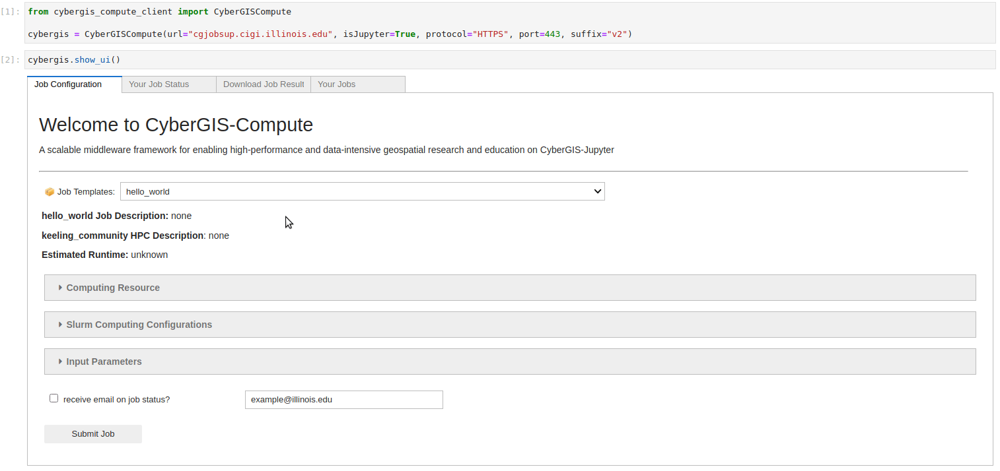

.. CyberGIS-Compute Python SDK documentation master file, created by
   sphinx-quickstart on Wed Mar 16 10:46:27 2022.
   You can adapt this file completely to your liking, but it should at least
   contain the root `toctree` directive.

Welcome to CyberGIS-Compute Python SDK's documentation!
=======================================================

Welcome to the documentation for CyberGIS-Compute! CyberGIS-Compute is designed to increase accessibility to super-computing resources by lowering the technical barriers, with a focus on geospatial problem solving. Our goal is to provide a simple and easy-to-use interface for users and model developers alike! This is important to ensure that everyone can use and benefit from CyberGIS-Compute regardless of their technical skills. We hope that by lowering the technical barriers, we can empower domain experts, policy makers, students, and everyone in between to harness the power of today's advanced cyberinfrastructure!

Why use CyberGIS-Compute?
-------------------------

Have you ever tried to run code or some analysis, but your laptop didn't have enough storage/memory/it was too slow on your computer? That's a pretty common problem, especially with the growth of big data and AI in geospatial problem solving and we are here with the solution! 

There are a variety of High-Performance Computing (HPC) resources which can handle the analysis/model/code you're trying to run, although there are usually some technical hurdles to overcome to use them. We are here to make things a bit easier! All you need to do is make a few small changes to your code (like put the results in the results folder), add some metadata to your code, put it in Github, and then you can run the code on HPC from a Jupyter notebook/lab interface! This also means that distributing your code is much easier: anyone can run the job themselves without needing direct access to the HPC resources! For an example of the CyberGIS-Compute interface, see below:

Demo Hello World
----------------

    
    Here you can see submission of a simple "Hello World" job. It uploads and downloads data while running a few commands on the Keeling compute cluster.

`You can view the UI for the Hello World notebook here. <notebooks/hello_world.html>`_

Table of Contents
-----------------

.. toctree::
   :maxdepth: 2
   
   about.rst
   usage.rst
   notebooks/hello_world
   models.rst
   release-notes.rst
   external.rst
   help.rst
   model_contribution/index.rst
   reference.rst
   contributing.rst

Indices and tables
------------------

* :ref:`genindex`
* :ref:`modindex`
* :ref:`search`
