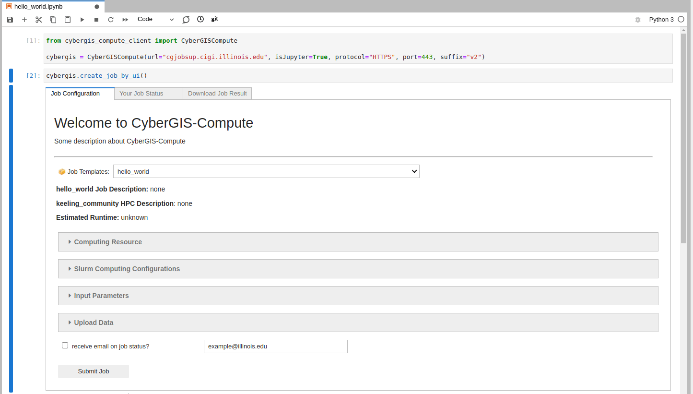

.. CyberGIS-Compute Python SDK documentation master file, created by
   sphinx-quickstart on Wed Mar 16 10:46:27 2022.
   You can adapt this file completely to your liking, but it should at least
   contain the root `toctree` directive.

Welcome to CyberGIS-Compute Python SDK's documentation!
=======================================================

.. attention::
    This site is still under construction.

Demo Hello World
----------------

    
    Here you can see submission of a simple "Hello World" job. It uploads and downloads data while running a few commands on the Keeling compute cluster.

`You can view the UI for the Hello World notebook here. <notebooks/hello_world.html>`_

Table of Contents
-----------------

.. toctree::
   :maxdepth: 2
   
   about.rst
   jobs.rst
   external.rst
   help.rst
   reference.rst
   contributing.rst

Indices and tables
------------------

* :ref:`genindex`
* :ref:`modindex`
* :ref:`search`
