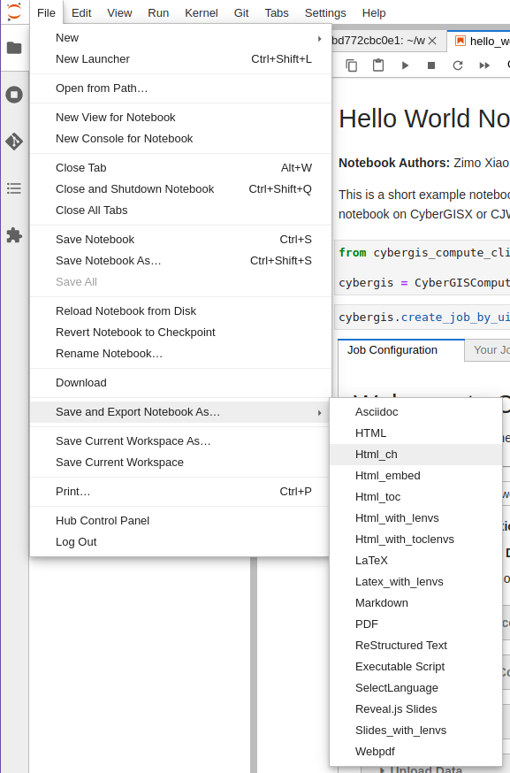
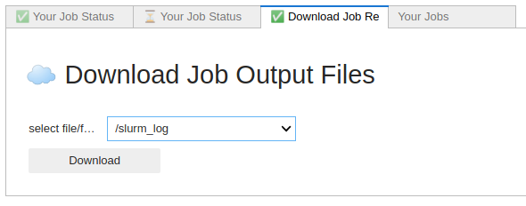

Developing a Model with CyberGIS-Compute
========================================

This section walks you through converting a Jupyter notebook to a model for CyberGIS-Compute. The examples use Python for simplicity, but Compute supports arbitrary software and languages.

.. tip::

    If you haven't already, we highly recommend starting with the notebooks in the Pysal Access Compute Example (specifically `IntroToCyberGIS-Compute.ipynb <https://github.com/cybergis/pysal-access-compute-example/blob/main/IntroToCyberGIS-Compute.ipynb>`_ and `ContributingAModel.ipynb <https://github.com/cybergis/pysal-access-compute-example/blob/main/ContributingAModel.ipynb>`_) which are available:

    * On CyberGISX Hub: `https://cybergisxhub.cigi.illinois.edu/notebook/pysal-access-compute-example/ <https://cybergisxhub.cigi.illinois.edu/notebook/pysal-access-compute-example/>`_
    * On Github: `https://github.com/cybergis/pysal-access-compute-example <https://github.com/cybergis/pysal-access-compute-example>`_ 

    The `CyberGIS-Compute-Examples <https://github.com/cybergis/cybergis-compute-examples>`_ repository also has a guided walkthrough for creating a CyberGIS-Compute model with three simple examples.

    We recommend these notebooks first to get some hands-on experience with CyberGIS-Compute before diving into making your own model!

What are the stages of your model?
----------------------------------

First, ask yourself, what are the different steps/stages of my model? CyberGIS-Compute offers flexibility by providing a pre processing stage, executation stage, and post-processing stage. Some examples of how you can use those stages are:

* [Pre] Install packages with Pip --> [Main] Run a model in Python (this model!)
* [Pre] Compile code --> [Main] Run the model --> [Post] Manage/analyze the model outputs
* [Pre] Download data --> [Main] Analyze the data

It is best to have each stage contained within a single script/line (i.e. ``python my_model.py`` or ``bash run_the_model.sh``) for simplicity.

Notebook to Script/Nbconvert
----------------------------

If you already have your code as a script that can run, this part is mostly done! If you have it as a Jupyter notebook, this section talks about converting that to an executable script.

You can use nbconvert to convert your notebook to a script. Note that any lines with bash (“!<bash command>”) and ipywidgets won’t run correctly as a script. The command line syntax (docs here: `https://nbconvert.readthedocs.io/en/latest/usage.html <https://nbconvert.readthedocs.io/en/latest/usage.html>`_) for nbconvert looks like::

    jupyter nbconvert --to FORMAT notebook.ipynb

Alternatively you can do this in Jupyterlab. Open the notebook, go to “File”, then “Save and Export Notebook As…”, then select “Executable Script.” This will allow you to download the notebook as a .py Python script. 

   A screenshot of the JupyterLab interface exporting a notebook.

To test your script, you can run it in the command line with::

	python <your script>.py

Note that your python environment will need all of the necessary packages to fully run the program.

Getting Results from Compute
----------------------------

For simple output, you can use the SLURM logs. If you print the necessary output information in your script, it will be displayed in the job's SLURM logs.

These logs will be saved in the output folder that you can download with the UI. When you download this folder after your job runs, there will be a subfolder titled slurm_logs. In that folder, there will be a job.stdout file with the SLURM logs in it.

   A screenshot of the "Download Job Results" tab in the Compute UI.

For more involved output, it is best to save information to the result_folder. You can get the path to this with the “result_folder” environment variable (os.environ[“result_folder”] in Python). Any files saved here can be downloaded from the UI after your job runs.

Crash Course in the Manifest
----------------------------

This section walks through the basics of how to set up a manifest that runs this script as a main step. More complex workflows are supported (pre- and post-processing stages), but many times the work can be compiled into a singular script to run.

As a first step, you must create a manifest.json file that just runs your script. To start, add a manifest.json file to your repository. For a very basic project, you will need name, container, execution_stage, slurm_input_rules, and require_upload_data as fields. Here is an overview of what the different fields mean and the information each should contain: 

* **name:** The name of your model.
* **container:** The container environment to run your code on. We recommend "python" or "cybergisx-0.4" as a default.
* **execution_stage:** The bash command that runs when the project begins. In this case, we are just running whatever your script is, so “python <your script>.py” will be sufficient.
* **slurm_input_rules:** The HPC resources being used. This usually defines the max and min, but you will be able to adjust this when submitting individual jobs in the section of dropdowns before you submit. In this example, there is time, the runtime limit, num_of_task, the number of times your task will run, and memory_per_cpu, the amount of memory per CPU.
* **require_upload_data:** Whether or not your project requires users to upload data

An example manifest from the `Pysal Access Compute Example model <https://github.com/cybergis/pysal-access-compute-example>`_ can be seen below::

    {
        "name": "Pysal Access Example",
        "container": "cybergisx-0.4",
        "pre_processing_stage": "bash install_access.sh",
        "execution_stage": "python ChicagoAccess.py",
        "post_processing_stage": "ls",
        "slurm_input_rules": {
            "time": {
                    "max": 30,
                    "min": 15,
                    "default_value": 20,
                    "step": 1,
                    "unit": "Minutes"   
                },
                "memory": {
                    "max": 4,
                    "min": 2,
                    "default_value": 4,
                    "step": 1,
                    "unit": "GB"
                }
        },
        "require_upload_data": false
    }

For more information see `Advanced Topic: Manifest Options`_.

Crash Course in SLURM Parameters
--------------------------------

Slurm parameters can be added by adding a “slurm_input_rules” to the manifest.json file. These will then be rendered in the UI when model users submit a job. In the manifest crash course, you set three parameters, the time, num_of_task, and memory_per_cpu. There are a lot more that can be added. Here is a list of supported inputs and what they represent:

* **num_of_node (integerRule):** The number of nodes allocated to this job. 
* **num_of_task (integerRule):** The number of tasks.
* **time (integerRule):** The runtime limit.
* **cpu_per_task (integerRule):** The job steps will require this many CPUs per task.
* **memory_per_cpu (integerRule):** Minimum memory required per allocated CPU. 
* **memory_per_gpu (integerRule):** Minimum memory per allocated GPU.
* **memory (integerRule):** Total memory allocated.
* **gpus (integerRule):** The total number of GPUS required for the job.
* **gpus_per_node (integerRule):** The number of GPUs required for the job on each node included in the job’s resource allocation.
* **gpus_per_socket (integerRule):** The number of GPUs required for the job on each socket included in the job's resource allocation.
* **gpus_per_task (integerRule):** The number of GPUs required for the job on each task to be spawned in the job's resource allocation.
* **partition (stringOptionRule):** The partition name on the HPC.

You can specify these SLURM parameters including a reasonable range for running your model. The UI will read from this manifest and populate widgets for users to specify SLURM settings. The widgets available for each SLURM parameter are::

    {
        // ...
        "slurm_input_rules": {
            "num_of_node": integerRule,     // number of nodes, ie. SBATCH nodes
            "num_of_task": integerRule,     // number of tasks, ie. SBATCH ntasks
            "time": integerRule,            // runtime limit, ie. SBATCH time
            "cpu_per_task": integerRule,    // number of CPU per task, ie. SBATCH cpus-per-task
            "memory_per_cpu": integerRule,  // amount of memory per CPU, ie. SBATCH mem-per-cpu
            "memory_per_gpu": integerRule,  // amount of memory per GPU, ie. SBATCH mem-per-gpu
            "memory": integerRule,          // total memory allocated, ie. SBATCH mem
            "gpus": integerRule,            // total GPU allocated, ie. SBATCH gpus
            "gpus_per_node": integerRule,   // number of GPU per node, ie. SBATCH gpus-per-node
            "gpus_per_socket": integerRule, // number of GPU per socket, ie. SBATCH gpus-per-socket
            "gpus_per_task": integerRule,   // number of GPU per task, ie. SBATCH gpus-per-task
            "partition": stringOptionRule   // partition name on HPC, ie. SBATCH partition
        }
    }

An example from the `SUMMA CyberGIS-Compute model's manifest <https://github.com/cybergis/cybergis-compute-v2-summa/blob/ef3c3bde53e44a85f929a023d2876c8e2e9652de/manifest.json>`_ can be seen below::

    "slurm_input_rules": {
   
           "time": {
                "max": 10,
                "min": 1,
                "default_value": 1,
                "step": 1,
                "unit": "Hours"   
            },
            "num_of_task": {
                "max": 127,
                "min": 1,
                "default_value": 9,
                "step": 1
            },
            "memory_per_cpu": {
                "max": 4,
                "min": 1,
                "default_value": 1,
                "step": 1,
                "unit": "GB"
            }    
    },

An example for ``stringOptionRule`` is::

    {
        "slurm_input_rules": {
            // ...
            "partition": {
                "type": "string_option",
                "options": ["option_a", "option_b", "option_c"],
                "default_value": "option_a"
            }
        }
    }

.. note::
    Please put in a reasonable range for your SLURM parameters. Compute relies on community resources and we must be respectful of other users within the community. Further, note that many end-users of Compute (students, domain experts, etc.) do not understand these parameters. Thus specifying a reasonable default and a narrow range of options is usually the best approach.

Supported HPC
-------------

The default is to only have Keeling (“keeling_community”) supported. We recommend that everyone use Keeling for testing purposes. However, it may not be suitable for all use-cases including very large memory execution and GPU computing. You can view the other community account options using the “cybergis.list_hpc()” command.

An example that supports multiple HPC centers is the `SUMMA model <https://github.com/cybergis/cybergis-compute-v2-summa/blob/ef3c3bde53e44a85f929a023d2876c8e2e9652de/manifest.json>`_ whose manifest can be viewed below::

    {
        "name": "SUMMA",
        "description": "SUMMA or the Structure for Unifying Multiple Modeling Alternatives is a hydrologic modeling approach that is built on a common set of conservation equations and a common numerical solver, which together constitute the structural core of the model. Different modeling approaches can then be implemented within the structural core, enabling a controlled and systematic analysis of alternative modeling options, and providing insight for future model development.",
        "estimated_runtime": "vary by model size, simulation period and configurations",
        "container": "summa-3.0.3",
        "pre_processing_stage": "python preprocessing.py",
        "execution_stage": "python main.py",
        "post_processing_stage": "python postprocessing.py",
        "slurm_input_rules": {
    
            "time": {
                    "max": 10,
                    "min": 1,
                    "default_value": 1,
                    "step": 1,
                    "unit": "Hours"   
                },
                "num_of_task": {
                    "max": 127,
                    "min": 1,
                    "default_value": 9,
                    "step": 1
                },
                "memory_per_cpu": {
                    "max": 4,
                    "min": 1,
                    "default_value": 1,
                    "step": 1,
                    "unit": "GB"
                }    
        },
        "require_upload_data": true,
        "supported_hpc": ["keeling_community", "expanse_community"],
        "default_hpc": "keeling_community"
    }

In particular, note the line::

    "supported_hpc": ["keeling_community", "expanse_community"],

which is simply specifying a list of supported HPCs: Keeling and Expanse. The line::

    "default_hpc": "keeling_community"

specifies that the HPC "keeling_community" should be the default option in the SDK UI's dropdown.

Providing Input Data
--------------------

You can make users upload data by setting “require_upload_data” to “true”. If this is selected, the user will be asked to upload data before submitting a job. Model developers can also use this mechanism to provide their data to jobs running with CyberGIS-Compute.

The path can be accessed by the job by accessing the “data_folder” environment variable (in Python, by using ``os.environ[“data_folder”]``). This can be done in the script or in preprocessing/postprocessing. The SUMMA job is an example of a job that requires data upload: `https://github.com/cybergis/cybergis-compute-v2-summa  <https://github.com/cybergis/cybergis-compute-v2-summa>`_

For model contributors who would like to provide all users data, there are a variety of options:

* **Github:** This is the preferred method although Github has data limits. For data larger than the limits, you could try compressing the data, but if that does not work there are other options.
* **Downloading Public Data:** If your data is hosted publically somewhere, this data can be downloaded by the Compute job (for example as part of the pre_processing_stage). There are a variety of tools for accomplishing this including `wget` in bash and `requests` in Python.
* **Downloading from Google Drive:** Another option is to host your data on Google Drive. Within CyberGIS-Compute, you can download the data using the Python `gdown package <https://github.com/wkentaro/gdown>`_

Installing Packages
-------------------

We have a library of containers you can draw from, with the most common being “cybergisx-0.4” and “python” which have a variety of standard Python packages. For most use-cases, you simply need to install a handful of packages with Pip or Conda to get your code running. 

A job that does this is the pysal-access Compute example. This job has a “pre_processing_stage” which runs a simple script to install the Pysal access package with pip (`see this line in the manifest <https://github.com/cybergis/pysal-access-compute-example/blob/7fbbc25d8f2842d8696013e03a31c22e79ccf537/manifest.json#L4>`_ which calls the script `install_access.sh <https://github.com/cybergis/pysal-access-compute-example/blob/7fbbc25d8f2842d8696013e03a31c22e79ccf537/install_access.sh>`_). We highly recommend this pattern of installing needed packages in the preprocessing steps when possible instead of using a custom container.

For more complex use cases, you can build a Docker or Singularity image which can run your code and we can add the container to our Core. However, we strongly recommend using one of our provided containers whenever possible.  See “Providing a Container” for more information.

Contributing Your Model
-----------------------

We are still working on the specific mechanism for having your model added to our deployment of compute. To have your model registered, please contact the CyberGIS-Compute team.

Advanced Topic: Manifest Options
--------------------------------

The manifest has a variety of options and here we will try to give a more comprehensive overview.

**Metadata:** These describe the model and provide metadata to the user. Examples are:

* **name:** the name of the model.
* **description:** a short textual description of the model.
* **estimated_runtime:** a short estimate of the runtime of your model.

**How to Run the Model:** These describe how Compute will run the model. Examples are:

* **container:** The Singularity container in which your job will run.
* **pre_processing_stage:** The first stage of your model.
* **execution_stage:** The second and main stage of your model.
* **post_processing_stage:** The third and final stage of your model.
* **slurm_input_rules:** The inputs passed to the SLURM job scheduler when running your job. Most common are time and memory, but we support more complex tasks (i.e. MPI, GPU). For more information, see ["Crash Course in SLURM Parameters" in our Model Contribution guide](https://cybergis.github.io/cybergis-compute-python-sdk/model_contribution/develop_model.html#crash-course-in-slurm-parameters).
* **supported_hpc/default_hpc:** CyberGIS-Compute supports a variety of High Performance Computing (HPC) resources and gives users/model contributors the ability to specify which resources their model runs on. For more information, see ["Supported HPC" in our Model Contribution guide](https://cybergis.github.io/cybergis-compute-python-sdk/model_contribution/develop_model.html#supported-hpc).

**How the User Interacts with Your Model:** CyberGIS-Compute provides the flexibility for users to customize jobs by specifying parameters, tweaking SLURM inputs, and uploading data.

* **param_rules:** This is a section that allows you to define widgets which users will use to pass parameters into the model. For more information, see `"Advanced Topic: Passing Parameters" in our Model Contribution guide <https://cybergis.github.io/cybergis-compute-python-sdk/model_contribution/develop_model.html#advanced-topic-passing-parameters>`_.
* **slurm_input_rules:** This information populates widgets allowing users to specify their SLURM settings. For more information, see `"Crash Course in SLURM Parameters" in our Model Contribution guide <https://cybergis.github.io/cybergis-compute-python-sdk/model_contribution/develop_model.html#crash-course-in-slurm-parameters>`_.
* **require_upload_data** This allows you to ask users for input data which can be used in your analysis. For more information, see `"Providing Input Data" in our Model Contribution guide <https://cybergis.github.io/cybergis-compute-python-sdk/model_contribution/develop_model.html#providing-input-data>`_.
* **default_result_folder_downloadable_path:** This allows you to specify the path within the result folder which will be the default option in the Download Results dropdown.

Advanced Topic: Passing Parameters
----------------------------------

To add basic parameters, add a field in the manifest file called “param_rules”. Define each parameter with the name and rules for model users when they submit their job. For example, adding the field to the left to your manifest.json file will allow the model user to input an integer 0-100 when submitting the job.

These parameter choices are added to the environment where your code executes. The value of a parameter “input_a” can be accessed by the script as the environment variable “param_input_a”. For example, in Python this can be done as “os.environ['param_input_a']” The WRFHydro job has params which are used in the compile.sh script: `https://github.com/cybergis/cybergis-compute-v2-wrfhydro <https://github.com/cybergis/cybergis-compute-v2-wrfhydro>`_

Advanced Topic: Providing a Container
-------------------------------------

Our containers are generally built as Docker images and then converted to Singularity containers when used on HPC. We do not currently have a system for contributing containers, but we are working on one. Check back soon!

Advanced Topic: Pre- and Post- Steps
------------------------------------

The "execution_stage" is required for every model, however, there are also optional pre- and post-processing stages which can be used. These offer greater flexibility in how your model runs. The stages in detail are:

1. **pre_processing_stage (string):** an *optional* bash command that runs when the project begins. Single threaded, non-MPI.
2. **execution_stage (string):** the **required** bash command that runs in multi-threaded MPI and executes the project. If you'd like to run sbatch command, use `execution_stage_in_raw_sbatch: Array<string>`
3. **post_processing_stage (string):** an *optional* bash command that runs after execution finishes. Single threaded, non-MPI.

A few examples of how one might use them:

* [Pre] Install packages with Pip --> [Main] Run a model in Python
* [Pre] Compile code --> [Main] Run the model --> [Post] Manage/analyze the model outputs

All of these steps are simply commands to run (usually calling a script). Example syntax for the manifest is::

    "pre_processing_stage": "python preprocessing.py",
    "execution_stage": "python main.py",
    "post_processing_stage": "python postprocessing.py",