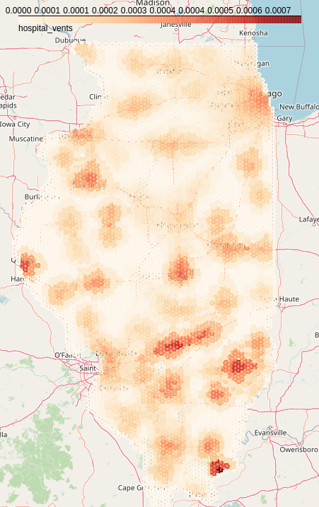
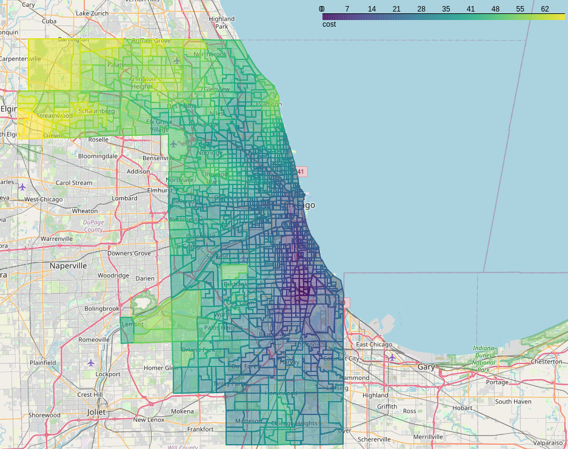
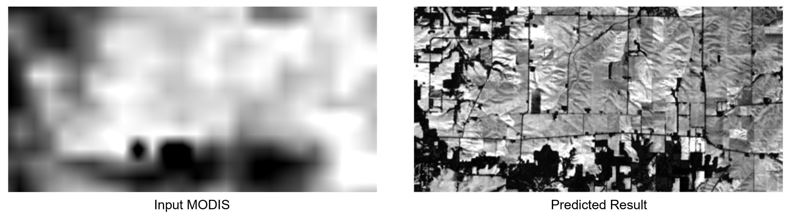

Model Gallery
=============

Hello World
-----------

Our simple "Hello World" model is available on Github: `cybergis/cybergis-compute-hello-world <https://github.com/cybergis/cybergis-compute-hello-world>`_

`You can view the UI for the Hello World notebook here. <notebooks/hello_world.html>`_

COVID-19 Spatial Accessibility
------------------------------

The COVID-19 Spatial Accessibility model (covid-access) uses CyberGIS-Compute to calculate spatial accessibility to hospital ventilators for the entire state of Illinois. It does this using the OpenStreetMap road network for Illinois, a dataset of hospitals, and population data. The model calculates travel-time catchments around each hospital on the OpenStreetMap road network and uses those catchments to calculate spatial accessibility. The work uses code from the following paper:

    Kang, JY., Michels, A., Lyu, F. et al. Rapidly measuring spatial accessibility of COVID-19 healthcare resources: a case study of Illinois, USA. Int J Health Geogr 19, 36 (2020). https://doi.org/10.1186/s12942-020-00229-x

* Github Repository: `cybergis/cybergis-compute-spatial-access-covid-19 <https://github.com/cybergis/cybergis-compute-spatial-access-covid-19>`_
* Related Publication: `"Rapidly measuring spatial accessibility of COVID-19 healthcare resources: a case study of Illinois, USA" <https://doi.org/10.1186/s12942-020-00229-x>`_
* Notebook on CyberGISxHub: `Calculating Accessibility to Ventilators in Illinois with CyberGIS-Compute <https://cybergisxhub.cigi.illinois.edu/notebook/calculating-accessibility-to-ventilators-in-illinois-with-cybergis-compute/>`_

Pysal Access
------------

This model (pysal-access) uses the `Pysal access Python package <https://github.com/pysal/access>`_ to calculate accessibility to doctors using a variety of different metrics in Chicago, IL. Those interested should `check out the paper on the package by Saxon et. al. <https://doi.org/10.1007/s42001-021-00126-8>`_

* Github Repository: `cybergis/pysal-access-compute-example <https://github.com/cybergis/pysal-access-compute-example>`_
* Notebook on CyberGISXHub: `Pysal Access Compute Example <https://cybergisxhub.cigi.illinois.edu/notebook/pysal-access-compute-example/>`_

Remote Sensing Image Fusion Model
---------------------------------

Remote sensing data fusion (data_fusion) has been extensively studied to generate high spatial- and temporal- resolution data products by integrating high-spatial-low-temporal resolution (such as Landsat) and high-temporal-low-spatial-resolution images (such as MODIS). In this model, we utilize a robust hybrid deep learning model based on a super-resolution convolutional neural network (SRCNN) and long short-term memory (LSTM) for spatiotemporal data fusion to integrate Landsat images with MODIS. The work uses code from the following paper:

    Fangzheng Lyu, Zijun Yang, Zimo Xiao, Chunyuan Diao, Jinwoo Park, and Shaowen Wang. 2022. CyberGIS for Scalable Remote Sensing Data Fusion. In Practice and Experience in Advanced Research Computing (PEARC '22). Association for Computing Machinery, New York, NY, USA, Article 35, 1-4. https://doi.org/10.1145/3491418.3535145

* Github Repository: `cybergis/data_fusion <https://github.com/cybergis/data_fusion>`_
* DOI for Paper: `10.1145/3491418.3535145 <https://doi.org/10.1145/3491418.3535145>`_
* Related Publication: `A Robust Hybrid Deep Learning Model for Spatiotemporal Image Fusion <https://doi.org/10.3390/rs13245005>`_

SUMMA
-----

The `Structure for Unifying Multiple Modeling Alternatives (SUMMA) <https://summa.readthedocs.io/en/latest/>`_ hydrological modeling framework can be run with CyberGIS-Compute:

* Github Repository: `cybergis/cybergis-compute-v2-summa <https://github.com/cybergis/cybergis-compute-v2-summa>`_
* Hydroshare Resource: `Implementation of SUMMA model using CyberGIS-Compute V2 <https://www.hydroshare.org/resource/fd553ef7d81b4a3da4538052dcfe8e0a/>`_
* Notebook on CyberGISXHub: `Run ensemble SUMMA 3.0 model on HPC with CyberGIS-Compute Service on CJW <https://cybergisxhub.cigi.illinois.edu/notebook/run-ensemble-summa-3-0-model-on-hpc-with-cybergis-compute-service-on-cjw/>`_

WRF-Hydro
---------

The `Weather Research and Forecasting Model Hydrological modeling system (WRF-Hydro) <https://ral.ucar.edu/projects/wrf_hydro/overview>`_ is a multi-scale framework for modeling hydrological processes.

* Github Repository: `cybergis/cybergis-compute-v2-wrfhydro <https://github.com/cybergis/cybergis-compute-v2-wrfhydro>`_
* Notebook on CyberGISXHub: `Run National Water Model (WRFHydro) on HPC through CyberGIS-Compute Service <https://cybergisxhub.cigi.illinois.edu/notebook/run-national-water-model-wrfhydro-on-hpc-through-cybergis-compute-service-2/>`_